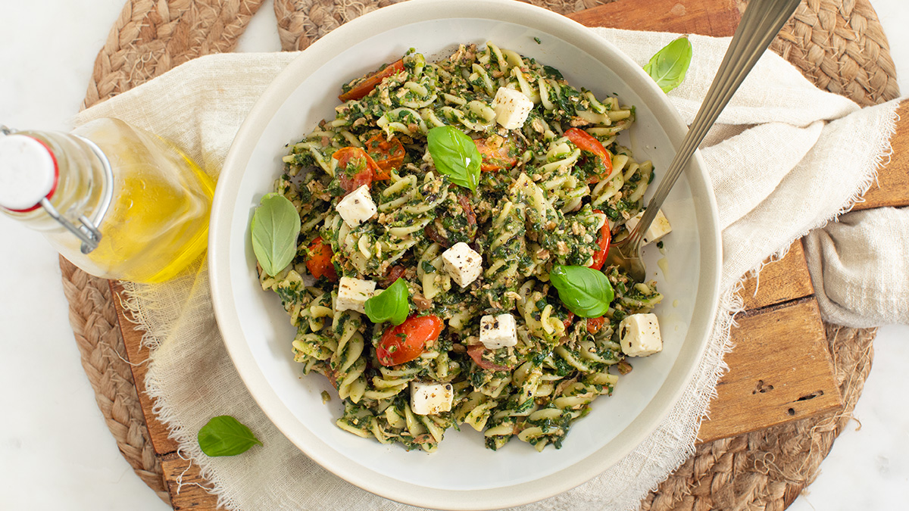

# les06
Dit is les06 voorbeeld
## test

INGREDIËNTEN (4 personen)

300 gr pasta
450 gr spinazie
2 blikjes tonijn (of plantaardige tonijn)
250 gr cherrytomaten
3 eetlepels groene pesto
1 pot witte kaasblokjes in olie en kruiden
1 uitje
2 tenen knoflook
peper en zout

1.Kook de pasta volgens de verpakking. Als je bevroren spinazie hebt, laat deze dan ontdooien en uitlekken.

2.Snijd ondertussen de ui en knoflook fijn. Fruit deze even kort aan in een grote koekenpan of hapjespan.

3.Snijd de tomaatjes door de helft. Doe de spinazie, tonijn en tomaatjes erbij en laat alles warm worden. Doe nu ook de pesto erbij.

4.Giet de pasta af zodra deze gekookt is en doe dit ook bij het spinazie-mengsel. Breng op smaak met peper en zout (naar eigen smaak).

5.Schep de pasta met tonijn en spinazie op een bord. Doe hier wat witte kaasblokjes overheen, zoveel je lekker vindt.

Tip: ook lekker met geroosterde pijnboompitjes.

[bron](https://www.leukerecepten.nl/recepten/pasta-met-tonijn-en-spinazie/)
